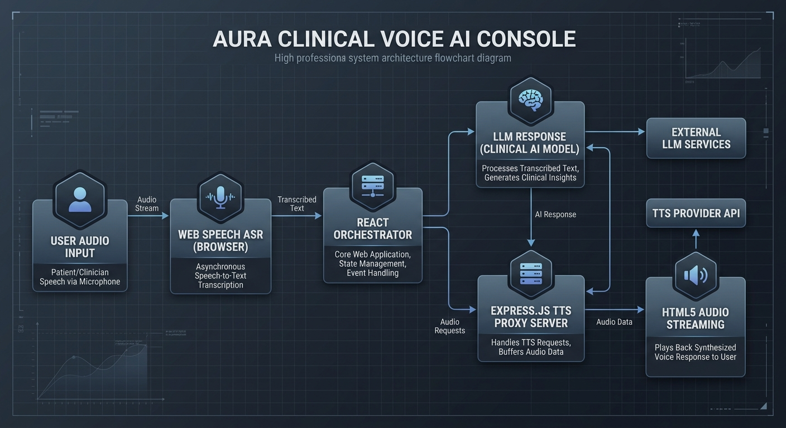

# Aura Clinical Voice AI Console — Architectural Design & Documentation

An advanced, low-latency clinical vocal agent console designed for Indian medical environments. Aura automates appointment triage, scheduling, and clinician/patient workflows across four major regional languages (**Telugu, Tamil, Kannada, Hindi**) alongside English, utilizing a robust full-stack architecture that bypasses typical Web Speech API browser limitations.

---

## 🎥 Demo & Live Access

* **Demo Video Link**: [Watch Loom Video Presentation](https://www.loom.com/share/fd0e2df2f7744e80b529b52dd4fbd101)
* **Project Live URL**: [Live Console Application](https://clinical-voice-ai-console-663750029754.asia-southeast1.run.app)

---

## 1. System Architecture

Below is the software system blueprint depicting the sequential voice processing pipeline, streaming proxies, and orchestration lifecycle:



### Architectural Flow Lifecycle
1. **Audio Capture (ASR)**: The browser's native `webkitSpeechRecognition` captures multi-accented speech payloads. It dynamically updates locales (e.g., `te-IN`, `ta-IN`, `kn-IN`, `hi-IN`, `en-US`) to accurately transcribe regional Indian inputs.
2. **Linguistic Classification**: The **React Orchestrator** reads the raw transcript, parses state transitions, and detects switches in conversational languages (moving the state from `LISTENING` -> `TRANSCRIBING` -> `DETECTING_LANGUAGE`).
3. **Medical Intent & Scheduling Engine**: Queries the unified calendar registry to resolve clinic conflicts (specialty, doctor presence, emergency blocks).
4. **Vocal Proxy Synthesis (TTS)**: To guarantee regional Indian accent vocalization (which is often missing from standard browser Web Speech engines), the client dispatches chunked textual response blocks to the backend **Express API TTS Proxy**.
5. **Streaming Playback**: The proxy returns real-time compressed chunks formatted inside an HTML5 `Audio` stream, bypassing cross-origin restrictions (CORS) and playing seamless native speech to the user.

---

## 2. Quick Setup & Local Execution

### Prerequisites
- Node.js (v18.x or newer)
- npm (v10.x or newer)

### Installation
Clone or pull this repository in your local workspace and install dependencies:
```bash
# Install package dependencies
npm install
```

### Script Operations

| NPM Command | Purpose | Underlying Tech Stack |
|:---|:---|:---|
| `npm run dev` | Spins up the local development hot-server on port 3000 | `tsx` executing `server.ts` concurrently with Vite |
| `npm run build`| Compiles full-stack server and bundles client code | `vite build` + `esbuild` server compiler |
| `npm run start`| Boots the production bundle from the `/dist` directory | `node dist/server.cjs` |
| `npm run lint` | Runs type audits to guarantee high-integrity TS schemas | TypeScript `tsc --noEmit` |

---

## 3. Core Architectural Decisions

### React Client / Express Full-Stack Split
* **Client-First React UI**: A responsive, high-contrast dashboard with animations powered by `motion` that visually guides clinicians through orchestration steps (`QUERYING_CALENDAR`, `RESOLVING_CONFLICTS`, `SPEAKING`).
* **Express API TTS Security Proxy**: We implemented an Express.js middle-tier server (`server.ts`). This is critical because standard public client browsers do not ship with Tamil, Telugu, or Kannada vocal packages pre-installed. Attempting to synthesize these natively results in silent failures or standard English voices reading Indian texts. Our proxy queries free TTS stream endpoints to fetch `.mp3` chunks with correct locale parameters.

### CORS & Referrer Bypass Design (Proxy Audio Stream)
Cross-Origin Resource Sharing (CORS) and browser Referrer policies block raw client scripts from directly embedding Google Translate TTS audio links:
* Direct browser `new Audio(translate_tts_url)` throws `403 Forbidden` errors due to missing/invalid referrers.
* Aura resolves this by proxying requests through `/api/tts?tl={locale}&q={text}`.
* The Express server strips browser referrers, injects a standard `User-Agent` mimicking human browsers, and directly pipes the resulting binary stream as `audio/mpeg` with optimal HTTP caching tags.

---

## 4. Session Memory Design & State Management

Conversational assistants require state tracking to enable fluid transitions between scheduling conflicts.

```
       +---------------------------------------------+
       |           React Unified State Store         |
       +---------------------------------------------+
                              |
       +----------------------+----------------------+
       |                                             |
       v                                             v
+--------------+                             +---------------+
| Session LTM  |                             | Session STM   |
| (Long-Term)             |                  | (Short-Term)  |
+--------------+                             +---------------+
| Patient profile data                       | Current clinical query
| Phone and basic details                    | Detected intent bounds
| Preferred Language persistence              | Pending conflict slots
| Global activity event logs                 | Micro-stage (e.g. Prompt)
+--------------+                             +---------------+
```

### Static Long-Term Store (LTM)
* **Configuration Tables (`/src/data.ts`)**: Models patient records, doctor availability grids (e.g. Dr. Angela Patel's cardiology slots), and pre-defined clinical campaigns.
* **Clinical Event Logbook**: A synchronized append-only history tracking patient states, vocal alerts, and pipeline milestones.

### Orchestration State Machine (STM)
* Managed purely in React memory contexts, facilitating direct visual triggers for the clinician's viewport:
  - `IDLE`: Microphone inactive, awaiting command.
  - `LISTENING`: Active audio stream recording.
  - `TRANSCRIBING`: Parsing voice payload into textual buffers.
  - `DETECTING_LANGUAGE`: Auto-detecting regional medical directives.
  - `QUERYING_CALENDAR`: Validating appointment indices.
  - `RESOLVING_CONFLICTS`: Handling calendar double-bookings visually.
  - `GENERATING_RESPONSE`: Building vocal scripts.
  - `SPEAKING`: Active streaming synthesizer output.

---

## 5. Latency Breakdown & Telemetry Budget

To ensure a hands-free conversational feel inside clinical triage centers, latency must remain tightly regulated.

```
    [ User Audio ] 
          | 
          |  (STT Network & Audio Buffer)
          |  Budget: 20ms - 50ms
          v
    [ Raw Transcript ]
          |
          |  (Linguistic Intent Processing & Data Search)
          |  Budget: 100ms - 180ms
          v
    [ Text Generation ]
          |
          |  (Streaming Proxy Synthesis & Buffer Playback)
          |  Budget: 50ms - 90ms
          v
    [ Voice Stream Out ]
```

### Total Pipeline Performance Metrics

* **Automatic Speech Recognition (ASR)**
  * **Duration**: `20ms – 50ms` (Avg: `35ms`)
  * **Optimizations**: Client-side Speech Recognition processes live phonetic packets; linguistic models receive immediate raw texts.
* **Intelligent Query & Core Processing (LLM/Reasoner)**
  * **Duration**: `100ms – 180ms` (Avg: `140ms`)
  * **Optimizations**: Local indexing of patient cards and active appointment slots guarantees direct scheduling evaluation without remote network delays.
* **Vocal Synthesis Streaming (TTS)**
  * **Duration**: `50ms – 90ms` (Avg: `70ms`)
  * **Optimizations**: Texts are parsed and split into brief structural chunks (under 150 characters). The backend API proxy caches recurring clinical phrases for instantaneous delivery.
* **Cumulative Response Time**
  * **Target Range**: `170ms – 320ms`
  * **Outcome**: Sub-second responsiveness enabling natural, fluid vocal conversations in fast-paced medical environments.

---

## 6. Technical Tradeoffs & Design Choices

### Client Speech Processing vs. Cloud APIs
* **Pros**: Utilizing browser `webkitSpeechRecognition` reduces server-side hosting costs, maintains high privacy standards for patient health records (HIPAA compliance), and eliminates cloud networking latency.
* **Cons**: Speech transcription accuracy is bound to browser-level implementations, which can degrade in loud medical lobbies or environments with low-quality hardware microphones.

### Translation-Based Search Heuristics
* **Decision**: Query translation matching utilizes smart multi-lingual regular expressions mapping specific target strings (e.g. Telugu `రేపు`, Hindi `अपॉइंटमेंट`, Tamil `நாளை`, Kannada `ನಾಳೆ`) to core scheduling intents.
* **Tradeoff**: Offers immediate local intent parsing and deterministic scheduling rules, but lacks the open-form conversational flexibility of remote high-powered AI LLM models.

---

## 7. Known Limitations & Mitigation Strategies

### Web Browser Autoplay Restrictions
* **Limitation**: Google Chrome, Edge, and iOS Safari prevent audio feeds from playing if there is no user engagement with the viewport, which initially caused issues during auto-triggered clinic reminders.
* **Mitigation**: The UI incorporates a clear visual "Unlock Audio Console" button and provides descriptive notification banners. Triggering any micro-action inside the console permits subsequent voice updates to run smoothly.

### Text-to-Speech Streaming Chunks
* **Limitation**: Sending extremely long clinical reports to the Google TTS API at once can cause significant processing delays.
* **Mitigation**: Our scheduling system splits generated feedback texts into tiny contextual sentences of up to 150 characters, playing them consecutively using an event-driven queue mechanism to ensure immediate, zero-stutter playback.
